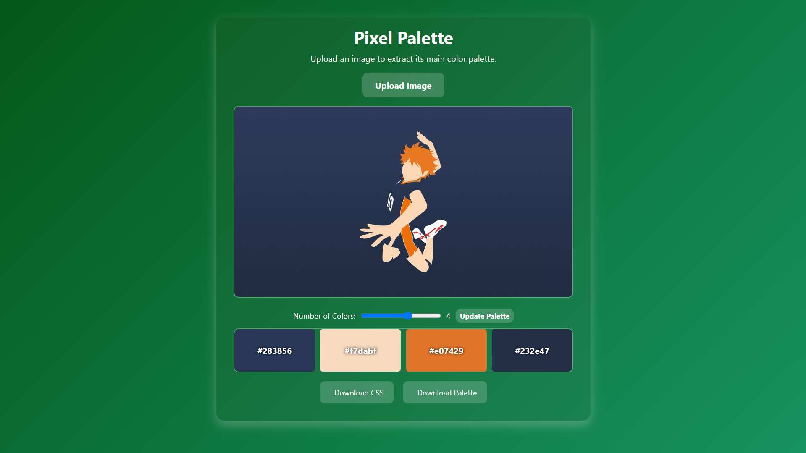
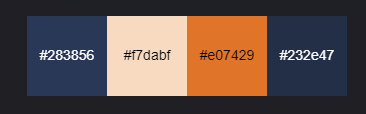
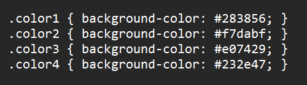

# Pixel Palette
PixelPalette is a web-based color palette extractor that extracts the main colors from any image. It generates a color strip with HEX codes based on how many colors specified and can be downloaded.

### How it works

1. Rasterize the Image
- Convert uploaded image to a raster format to allow the program to access individual pixels and their RGB values [4].

2. Convert Colors to LAB Space
- RGB values represent colors as combinations of Red, Green, and Blue but this space is not perceptually uniform.
- The project converts RGB to LAB color space:
  - L = lightness
  - A = green-red component
  - B = blue-yellow component
- LAB is better for color clustering because distances in LAB correspond more closely to human perception of color differences [4].

3. Extract Main Colors Using KMeans [2][3]
- All pixels are treated as points in 3D LAB space.
- KMeans clustering groups similar colors into k clusters (k = number of colors selected).
- The centroid of each cluster represents the main color in that group [3]. 

4. Convert Back to RGB & Generate HEX Codes
- After finding the cluster centroids in LAB space, they are converted back to RGB.
- Each color is then converted to HEX format (#RRGGBB) for display and downloading purposes.

5. Display Palette
- The extracted colors are displayed as a strip of color blocks with HEX codes.
- The number of extracted colors can be changed using the slider.
- Click the “Update Palette” button to refresh the palette with the new number of colors.
- Users can download:
  - CSS file
  - Palette image file

### Project Screenshots

**1. Uploading an image**

**2. Extracted palette**

**3. Download options**
- Palette Image file  
  
- CSS file  
 

### Installation & Running

#### 1. Clone the repository
git clone https://github.com/MaisarahQistina/pixel-palette.git  
cd pixel-palette

#### 2. Create & activate a virtual environment (Optional)

#### 3. Install dependencies
pip install flask numpy opencv-python scikit-learn pillow

#### 4. Run the Flask server
python app.py

#### 5. Open the web app in your browser
Go to: http://127.0.0.1:5000/

### References:
- [1] https://www.youtube.com/watch?v=yI9IPU9JI5k
- [2] https://informatika.stei.itb.ac.id/~rinaldi.munir/Citra/2023-2024/Makalah2023/Makalah-IF4073-Citra-2023%20%284%29.pdf
- [3] https://medium.com/@ys3372/deconstructing-an-image-with-pixels-4c65c3a2268c
- [4] https://opencv.org/blog/color-spaces-in-opencv/
